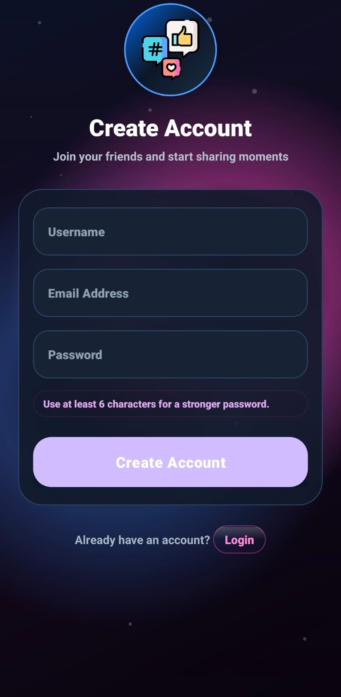
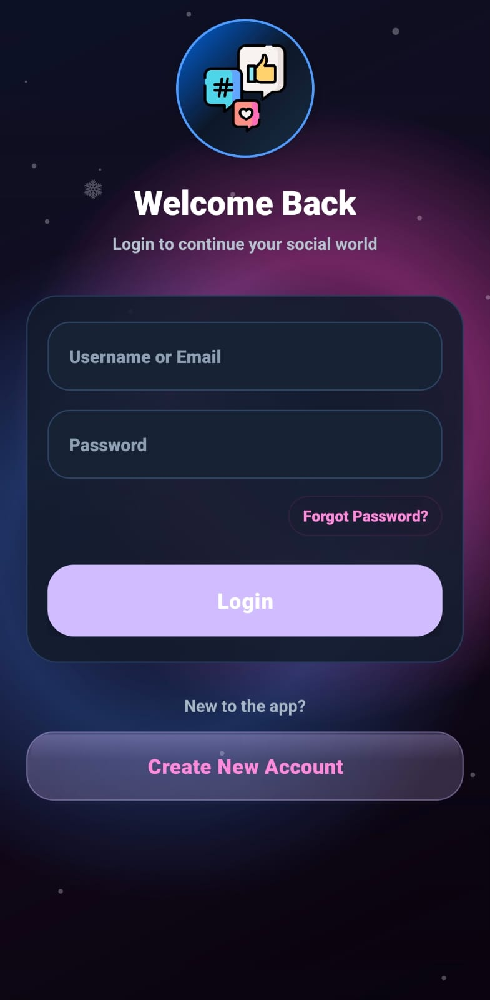
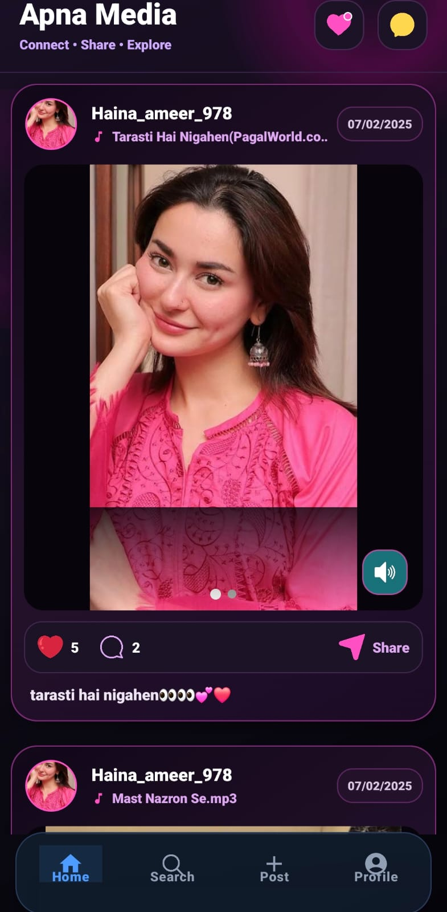
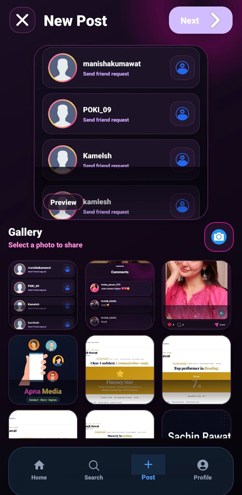
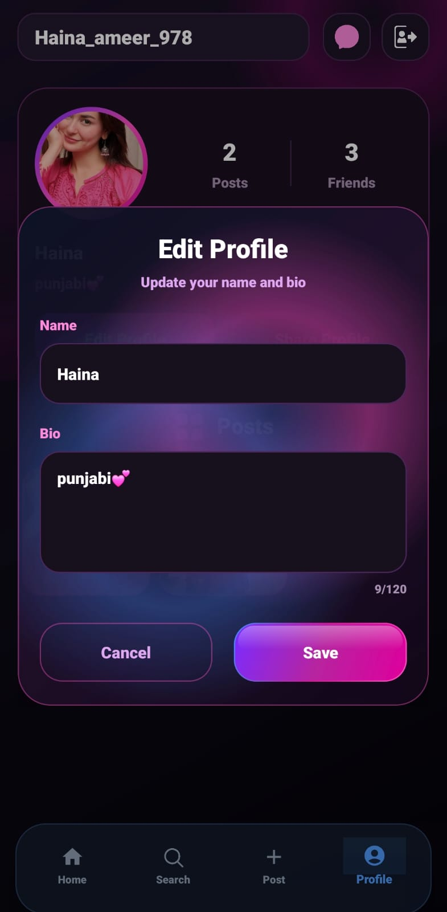
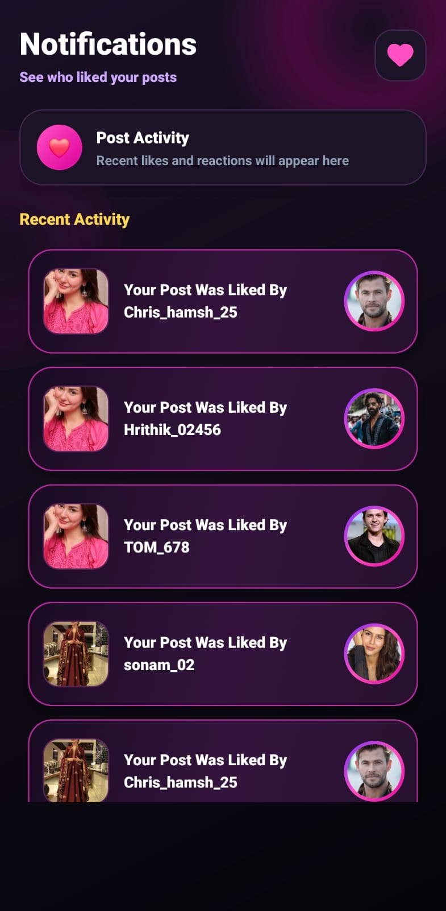
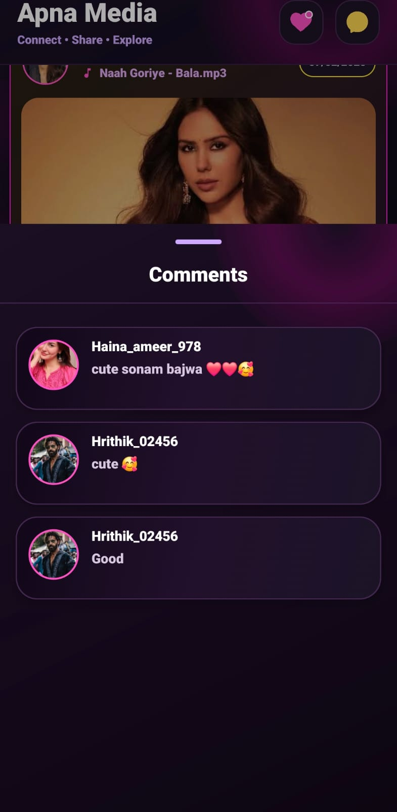
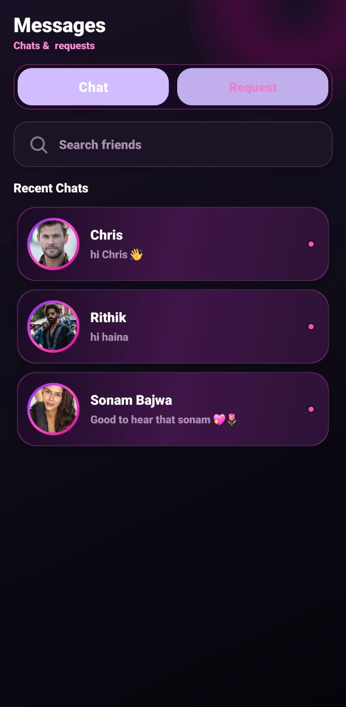
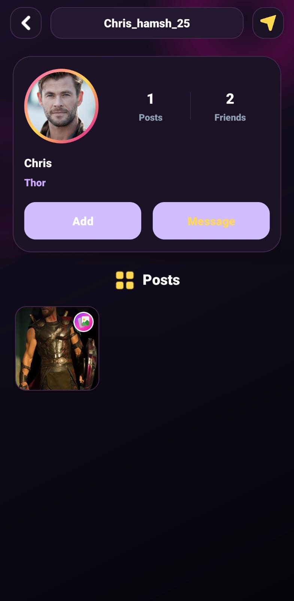

# Apna_Media_A_Social_Media_Platform
Apna Media is a full-stack social media application inspired by Instagram, featuring posts, stories, likes, comments, followers, and real-time messaging. Built using Kotlin, Firebase, and clean architecture principles to demonstrate production-level Android development skills.

## 📸 App Screenshots

<table align="center" cellpadding="10">

<tr>
  <td></td>
<td></td>
  <td></td>
  <td></td>
  <td></td>

  <td></td>
</tr>
<tr>
  <td></td>
  <td></td>
  <td></td>

  <td></td>

  <td></td>
</tr>
<tr>
    <td></td>

  <td></td>
   <td></td>
</tr>
  </table>

